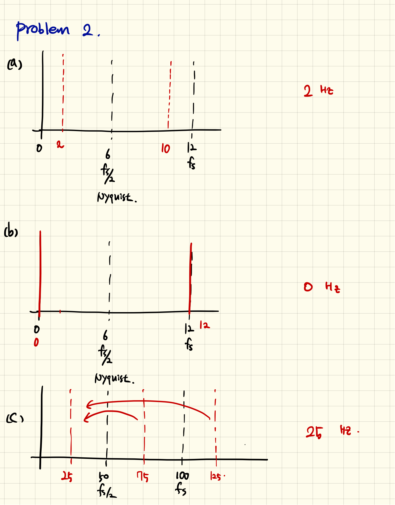
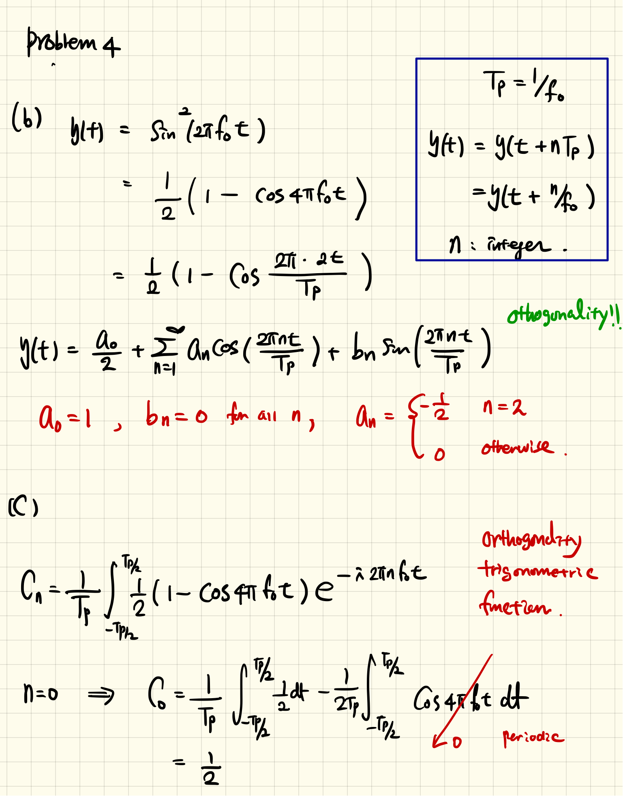
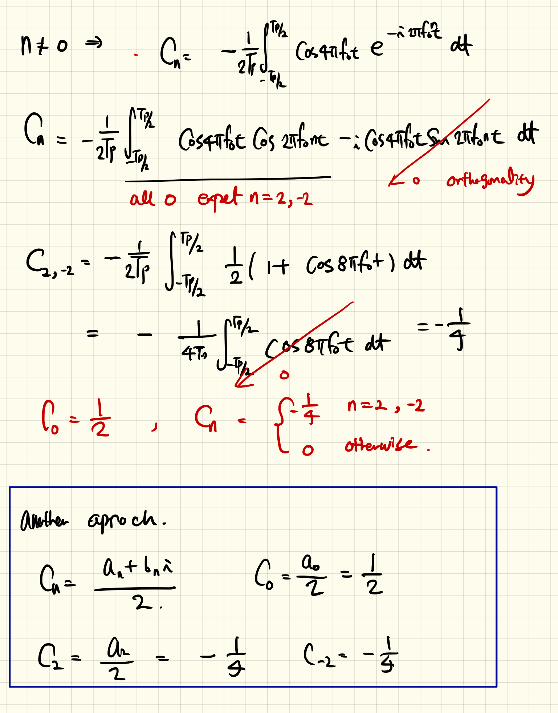
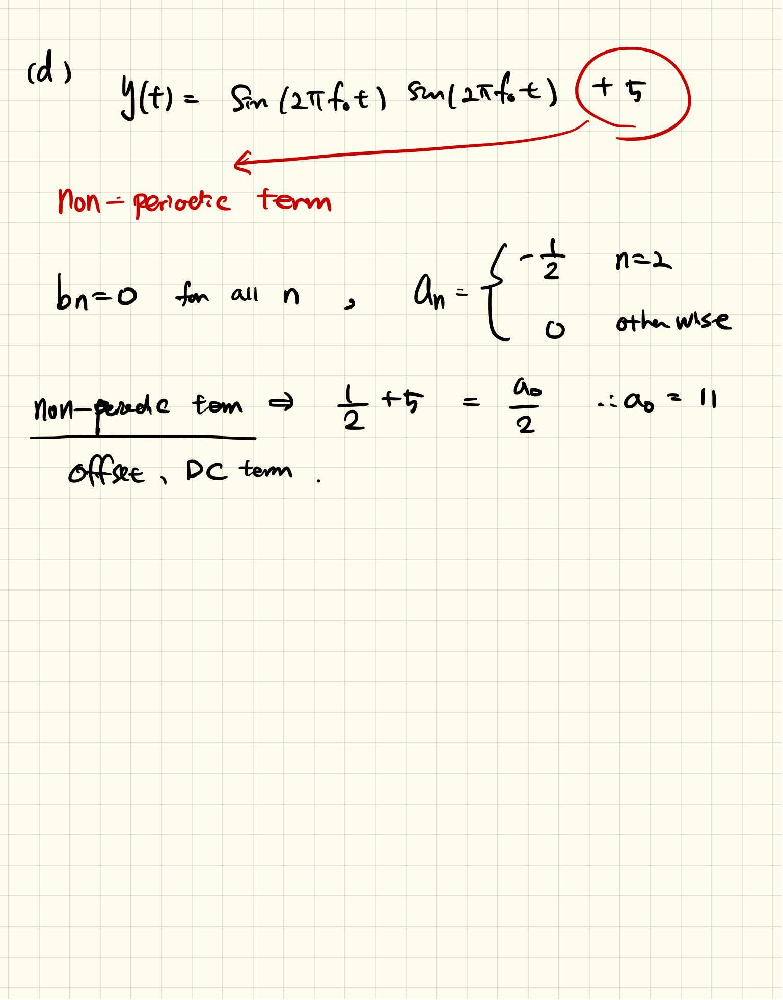
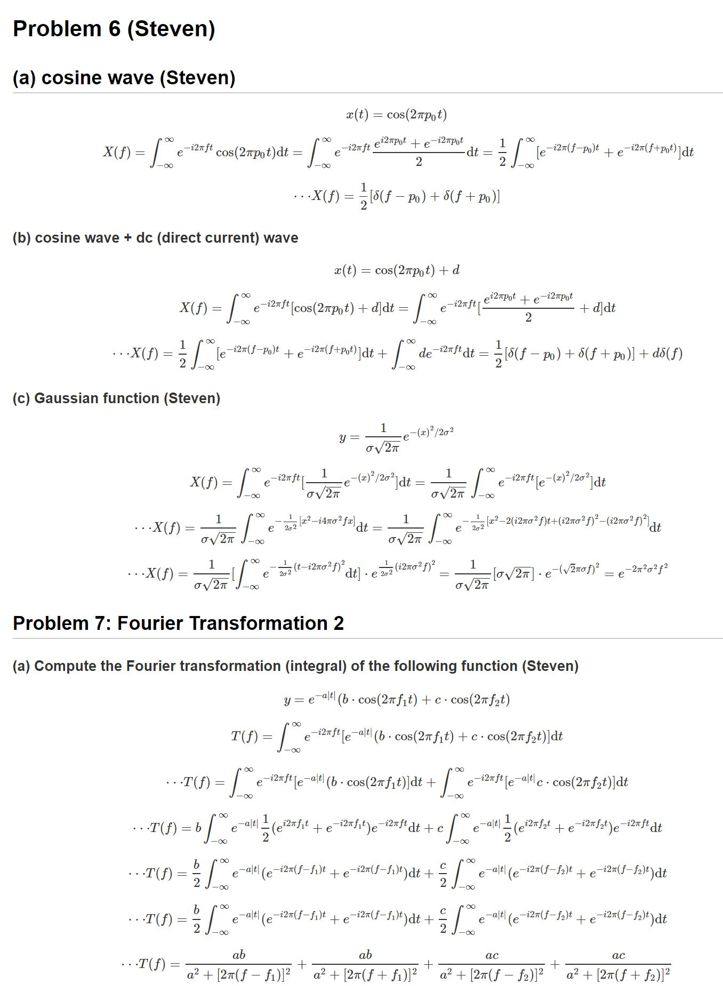

 Problem 1

(d) Plotting 6 Hz analog signal with 12Hz sampling frequency **(incorrect)**

(d) Plotting 12 Hz analog signal with 12Hz sampling frequency 

# Problem 2

# Problem 3 (Neil, Juan, Laurent)

**(a)** Please explain a quantization error. When do they occur? How to avoid? (Laurent)
Quantization error is an error stemming from the conversion of a continuous signal to a discrete signal. There is only a finite range of values which can be represented in a discrete signal, and so information is lost about what happens "between" the discrete points taken from the analog signal. This occurs in all digital sampling cases - one would need infinite memory to fully suppress this error. In practice, the error can be effectively minimized by choosing a high enough resolution for the discrete signal to ensure that any data of interest is not missed between captured points.

No :loudspeaker: :loudspeaker: **Sampling rate**, **high resolution sensor**, **Oversampling**

**(b)** Please explain a clipping error. When do they occur? How to avoid? (Laurent)
Clipping occurs when the amplitude of a signal is higher than what the sensor can handle. For instance, in a photo, clipping occurs when too much light hits the sensor (overexposure) and everything simply appears white, with loss of information. This can be avoided by choosing a sensor appropriate for the data being captured, with a working range large enough for the analog signal.

No :loudspeaker: :loudspeaker: **Sensor**

**(c)** Please explain an oversampling issue. When do they occur? What are the consequence of the oversampling? (Neil)
* Oversampling means to sample with a sampling frequency that is (significantly) higher than the required nyquist_frequency+eps. 
* The amount of data is increased --> Vectorlength increased.
* **The SNR is increased (see https://en.wikipedia.org/wiki/Oversampling)**

# Problem 4 (Laurent)

# Problem 5 (Juan, Laurent)    

# Problem 6 and 7 (Steven)
